# owasp-api-top-10_devpira-security-wknd
Slides and contents from the talk "OWASP API Security Top 10 - A Guide to Implementing More Secure Back-Ends".

## References
- OWASP API Security Top 10 2023: https://owasp.org/API-Security/editions/2023/en/0x11-t10/
- Free Certifications APIsec University: https://www.apisecuniversity.com/courses
- Model Context Protocol (MCP): https://github.com/modelcontextprotocol
- Azure API Management: https://learn.microsoft.com/en-us/azure/api-management/
- Grafana Learn - GROT Academy: https://learn.grafana.com/
- Kong API Gateway: https://developer.konghq.com/gateway/
- Apache APISIX API Gateway: https://apisix.apache.org/
- Free Cybersecurity Certifications - Linux Foundation: https://training.linuxfoundation.org/full-catalog/?_sfm_price=0&_sft_topic_area=cybersecurity
- OWASP Top 10:2025: https://owasp.org/Top10/2025/
- OWASP MCP Top 10: https://owasp.org/www-project-mcp-top-10/
- OWASP Cheat Sheet Series: https://cheatsheetseries.owasp.org/
- OWASP Top 10 for Large Language Model Applications: https://owasp.org/www-project-top-10-for-large-language-model-applications/
- Docker Hardened Images: https://www.docker.com/products/hardened-images/

## OWASP API Security Top 10 2023

Risks that are part of the **OWASP Top 10 API Security Risks - 2023**:

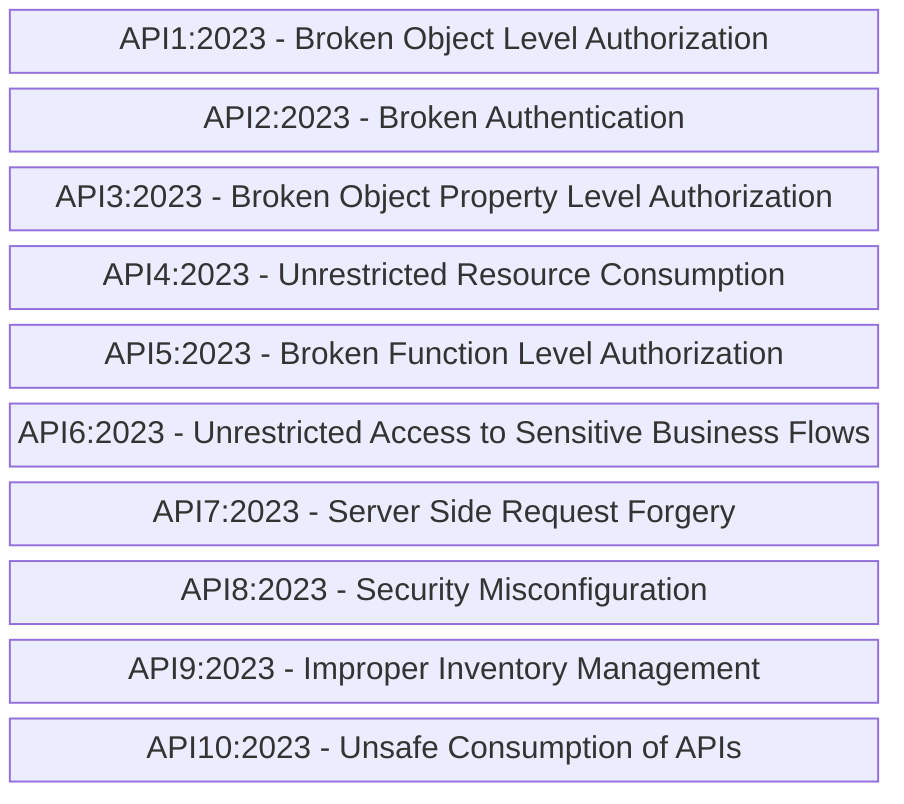

NOTE: To access the official list, click this [**link**](https://owasp.org/API-Security/editions/2023/en/0x11-t10/).

### API4:2023 - Unrestricted Resource Consumption

Mindmap with recommendations and important points on this item:

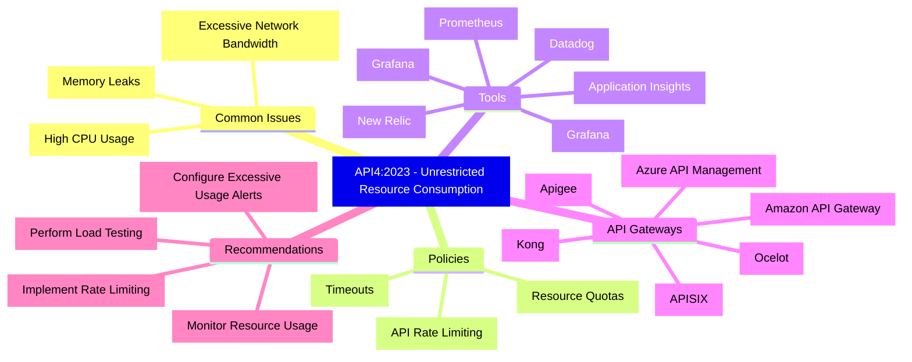
---

## Event Information

Talk title: **OWASP API Security Top 10 - A Guide to Implementing More Secure Back-Ends**

Event: **DEVPIRA Security WKND**

Date: **March 28, 2026 (Saturday)**

Technologies and topics covered: **.NET, ASP.NET Core, OWASP API Security Top 10, JWT, Cybersecurity, Grafana stack, Docker, NuGet, npm, API Gateways, Rate Limit, Resilience, Azure API Management, Microsoft Entra ID, Kong, APISIX...**

Number of attendees: **34 people**

Event link (registration): [**Eventiza**](https://eventiza.com.br/evento/devpira-security-wknd) | [**LinkedIn**](https://www.linkedin.com/posts/devpira_devpira-cybersecurity-segurancadainformacao-activity-7442522228178599936-S6zr)

Location: **Inova ACIPI - Rua Prudente de Morais, 459 - Centro - Piracicaba-SP - ZIP: 13400-310**

Click this [**link**](/img/) to view all photos from the talk.

I would like to thank **Alexandre Ballestero**, **Fábio Baldin**, **Kaue Barros**, and the other organizers for all the support in having me as a speaker at this edition of **DEVPIRA Security WKND**.

Due to my participation in another event on the same date, I presented the content and interacted with the participants live online.

---

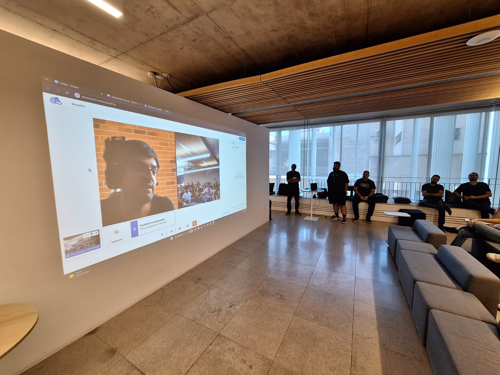

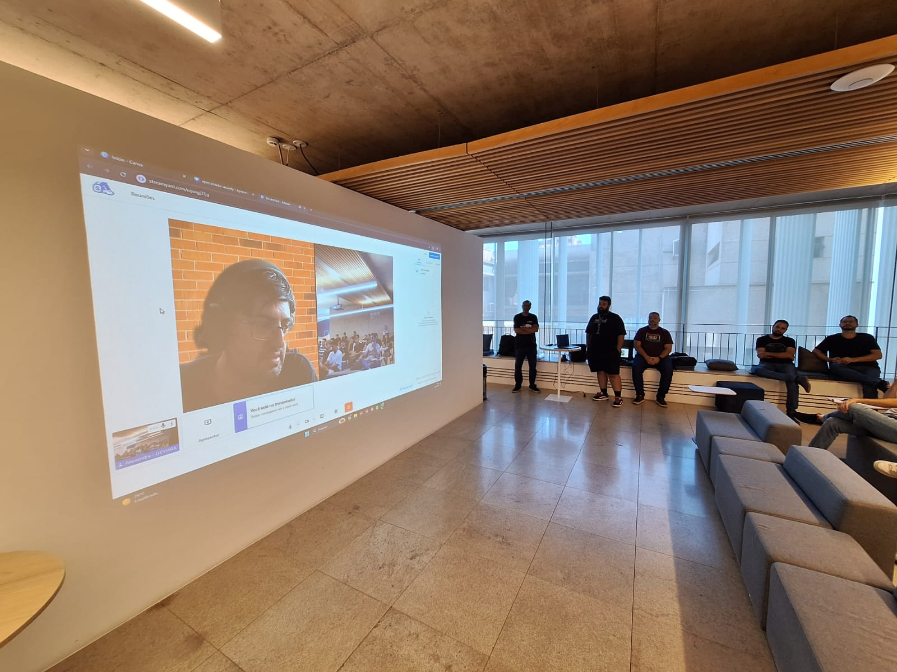

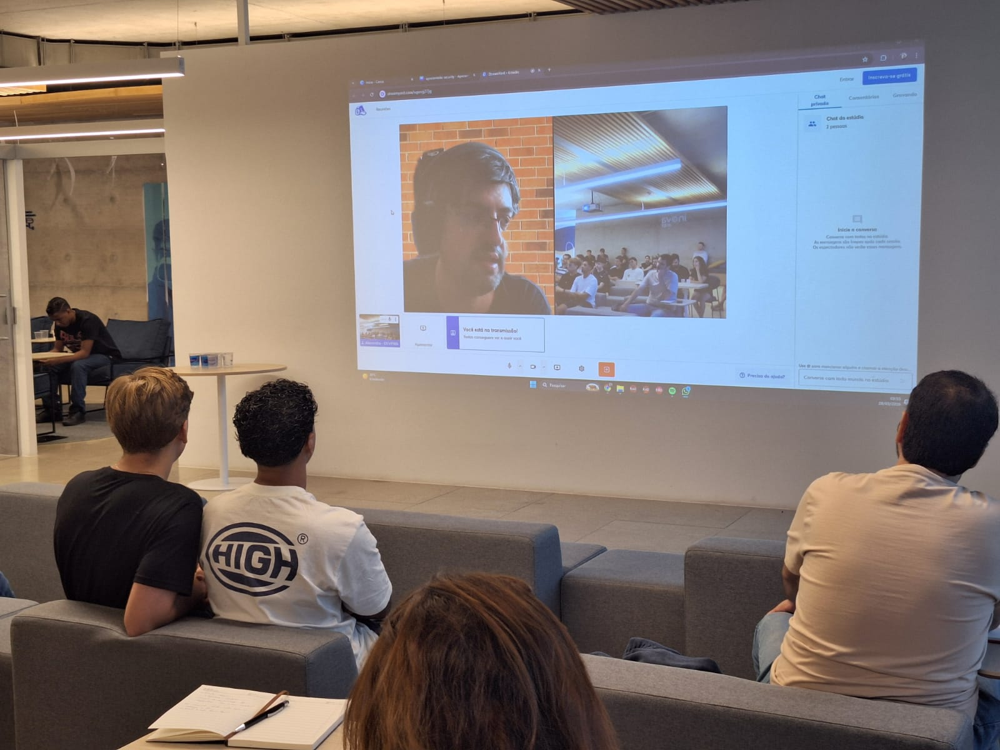

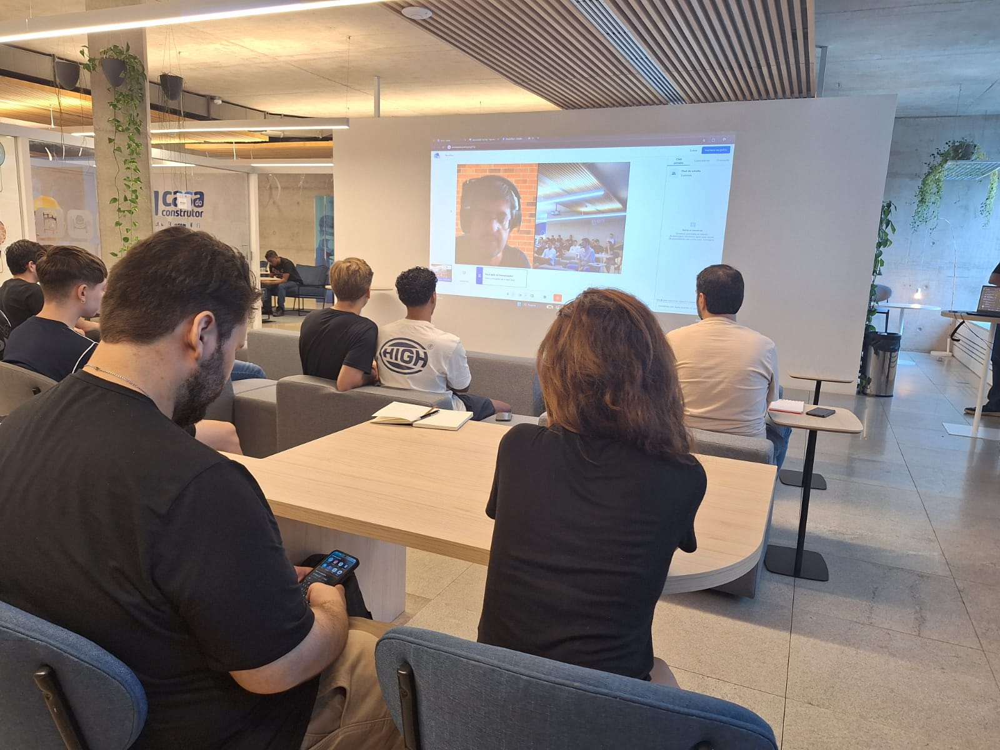

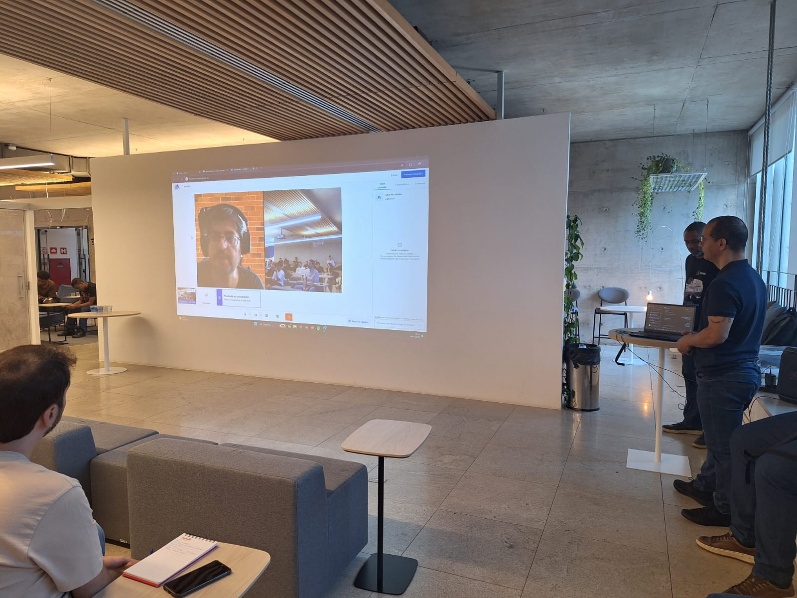

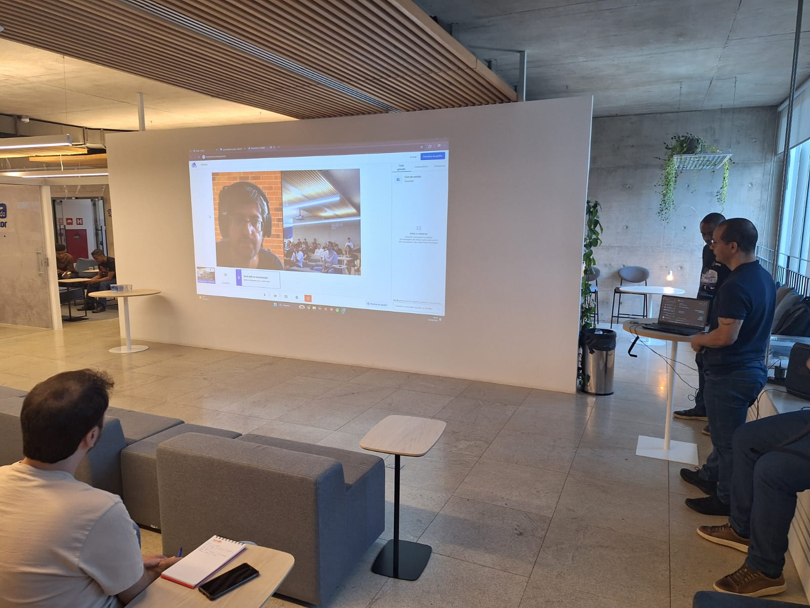

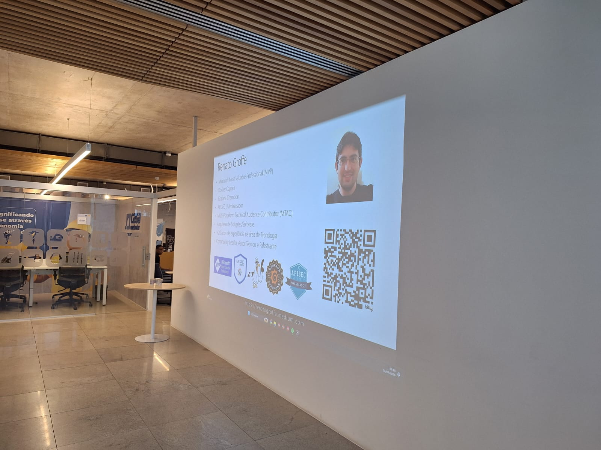

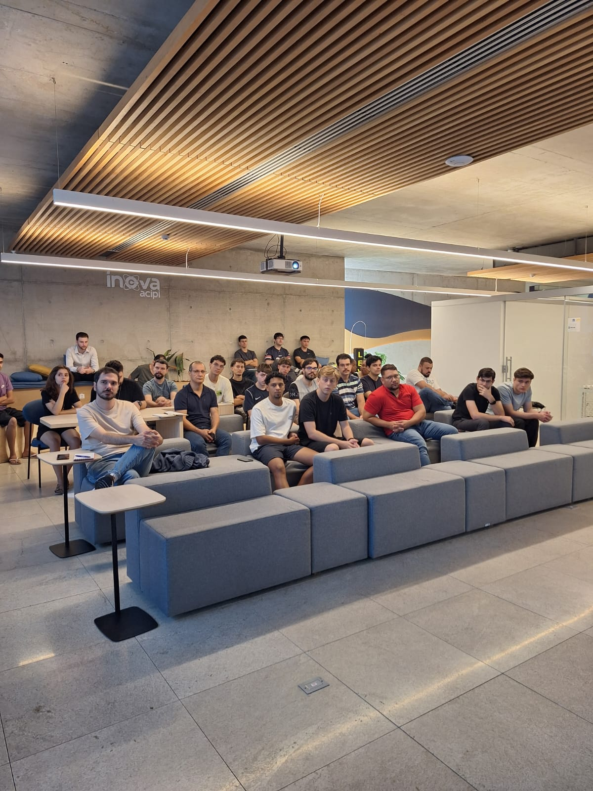

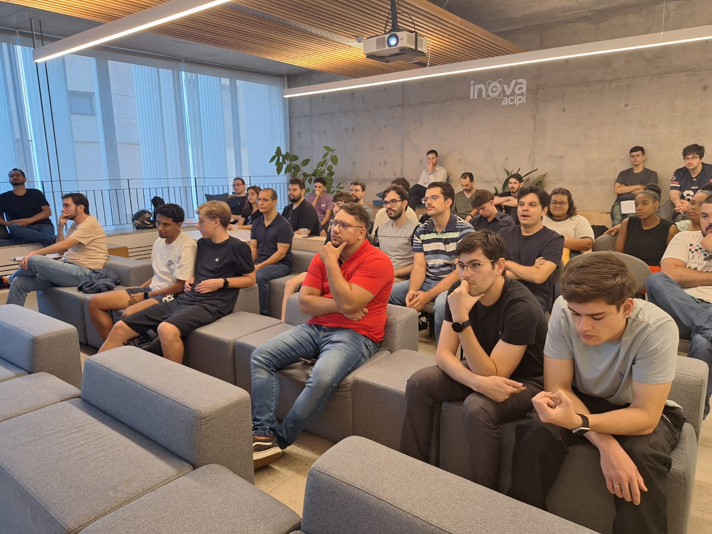

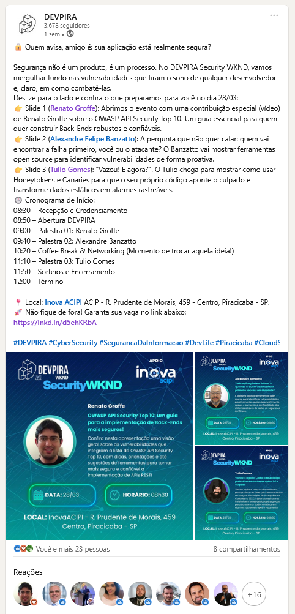

