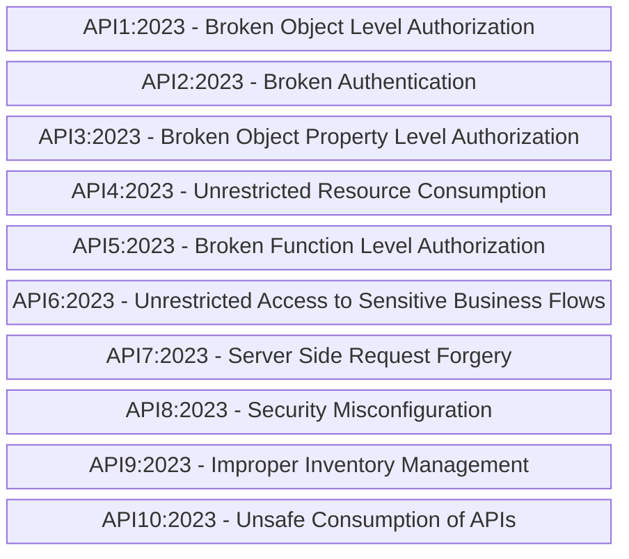
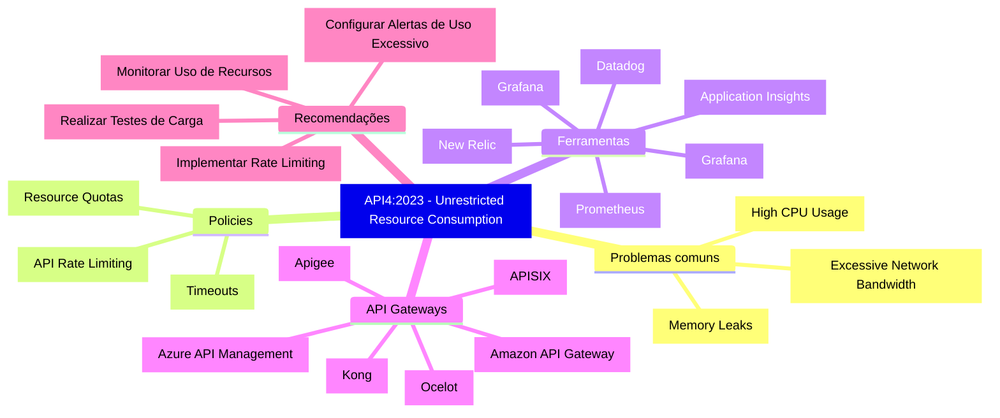
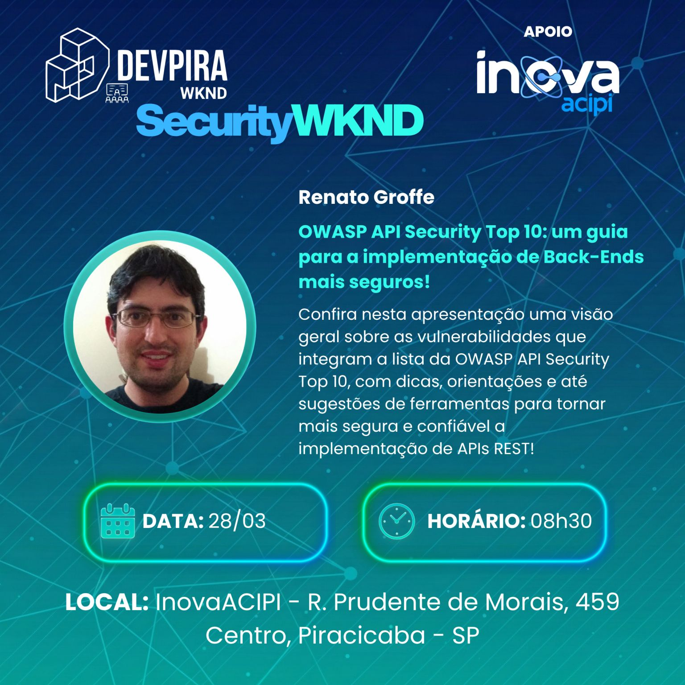
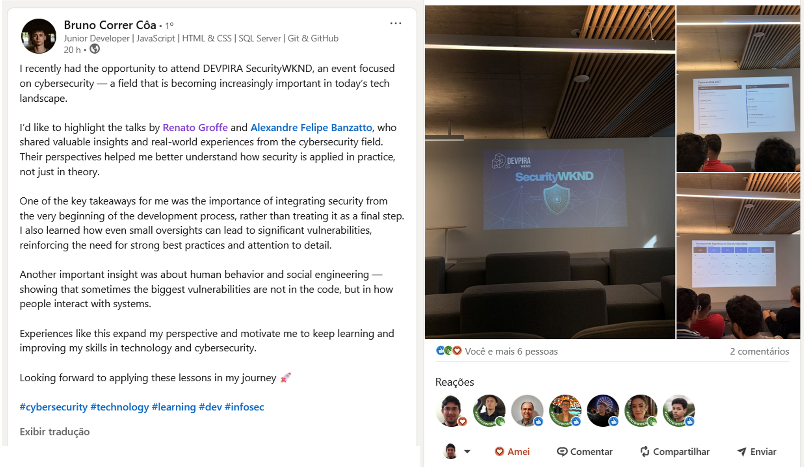

# owasp-api-top-10_devpira-security-wknd
Slides e conteúdos da apresentação "OWASP API Security Top 10 - Um guia para a implementação de Back-Ends mais seguros".

## Referências
- OWASP API Security Top 10 2023: https://owasp.org/API-Security/editions/2023/en/0x11-t10/
- Certificações Gratuitas APIsec University: https://www.apisecuniversity.com/courses
- Model Context Protocol (MCP): https://github.com/modelcontextprotocol
- Azure API Management: https://learn.microsoft.com/en-us/azure/api-management/
- Kong API Gateway: https://developer.konghq.com/gateway/
- Apache APISEX API Gateway: https://apisix.apache.org/
- Certificações Gratuitas em Cibersegurança - Linux Foundation: https://training.linuxfoundation.org/full-catalog/?_sfm_price=0&_sft_topic_area=cybersecurity
- OWASP Top 10:2025: https://owasp.org/Top10/2025/
- OWASP MCP Top 10: https://owasp.org/www-project-mcp-top-10/
- OWASP Cheat Sheet Series: https://cheatsheetseries.owasp.org/
- OWASP Top 10 for Large Language Model Applications: https://owasp.org/www-project-top-10-for-large-language-model-applications/
- Docker Hardened Images: https://www.docker.com/products/hardened-images/

## OWASP API Security Top 10 2023

Riscos que fazem parte da **OWASP Top 10 API Security Risks - 2023**:

OBSERVAÇÃO: Para acessar a listagem oficial clique neste [**link**](https://owasp.org/API-Security/editions/2023/en/0x11-t10/).

### API4:2023 - Unrestricted Resource Consumption

Mindmap com recomendações e pontos importantes neste item:

---

## Informações sobre o evento

Título da apresentação: **OWASP API Security Top 10 - Um guia para a implementação de Back-Ends mais seguros**

???????????Evento: **SQLSATURDAY São Paulo 2026**

Data: **28/03/2026 (sábado)**

???????????Tecnologias e tópicos abordados: **MCP, GitHub Copilot, Visual Studio Code, Inteligência Artificial, LLMs, Containers, Docker, Docker Hub, Docker MCP Catalog, Windows, Linux, macOS, .NET, ASP.NET Core, NuGet, Node.js, npm, pip, Python, Claude, SQL Server, PostgreSQL, Mermaid, draw.io, Excalidraw...**

Número de participantes: **34 pessoas**

Link do evento (inscrições): [**Eventiza**](https://eventiza.com.br/evento/devpira-security-wknd) | [**LinkedIn**](https://www.linkedin.com/posts/devpira_devpira-cybersecurity-segurancadainformacao-activity-7442522228178599936-S6zr)

Local: **Inova ACIPI - Rua Prudente de Morais, 459 - Centro - Piracicaba-SP - CEP: 13400-310**

Acesse este [**link**](/img/) para visualizar todas as fotos da apresentação.

???????????Deixo aqui meus agradecimentos ao **Marcelo Adade (Microsoft MVP)**, **André Di Battista (volutário no evento)** e demais organizadores por todo o apoio para que participássemos como palestrantes desta edição do **SQLSaturday**.

---

