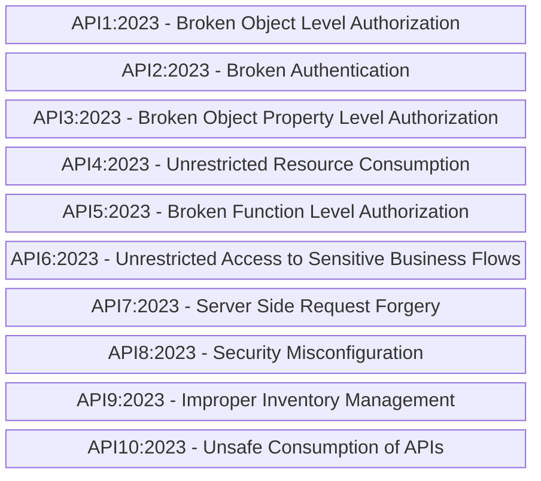
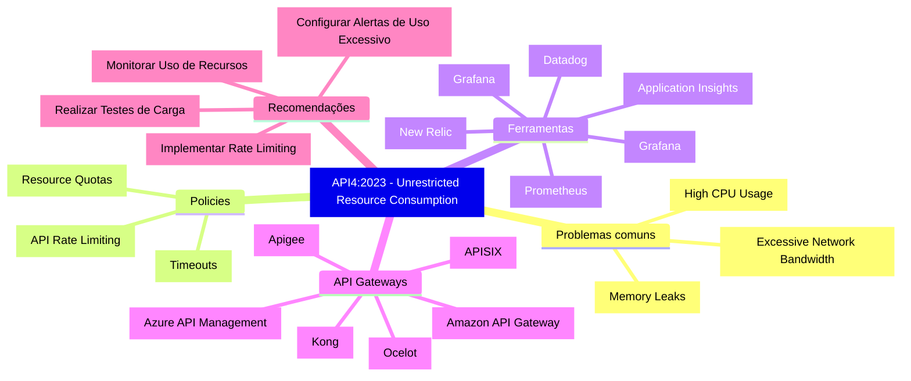

# owasp-api-top-10_devpira-security-wknd
Slides e conteúdos da apresentação "OWASP API Security Top 10 - Um guia para a implementação de Back-Ends mais seguros".

## OWASP API Security Top 10 2023

Riscos que fazem parte da **OWASP Top 10 API Security Risks - 2023**:

OBSERVAÇÃO: Para acessar a listagem oficial clique neste [**link**](https://owasp.org/API-Security/editions/2023/en/0x11-t10/).

### API4:2023 - Unrestricted Resource Consumption

Mindmap com recomendações e pontos importantes neste item:

